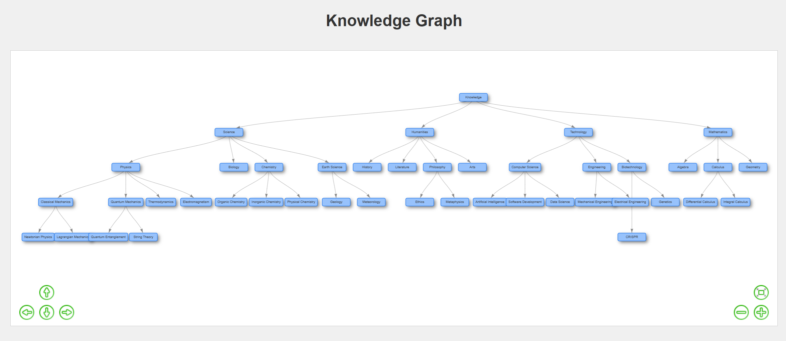

# All Knowledge Visualized

This project is an interactive visualization of a knowledge graph where you can recursively open different nodes to explore various branches of knowledge.

## Features

- Interactive, expandable knowledge graph
- Hierarchical visualization with nodes for different knowledge domains
- Recursively explore deeper levels of knowledge by clicking on nodes
- External JSON data source for easy maintenance and expansion

## Visualization

## How to Run

Due to browser security restrictions (CORS policy), you need to serve the files from a local web server instead of opening them directly from the file system.

### Method 1: Using Python's built-in HTTP server

1. Make sure you have Python installed
2. Open a terminal/command prompt in the project directory
3. Run one of the following commands:
   - Python 3: `python -m http.server`
   - Python 2: `python -m SimpleHTTPServer`
4. Open `http://localhost:8000` in your browser

### Method 2: Using Node.js http-server

1. Make sure you have Node.js and npm installed
2. Install http-server globally (if not already installed): `npm install -g http-server`
3. Open a terminal/command prompt in the project directory
4. Run: `http-server`
5. Open `http://localhost:8080` in your browser

### Method 3: Using an editor with a live server extension

If you're using Visual Studio Code or similar editors, you can install a "Live Server" extension to easily serve your files.

## How It Works

The knowledge graph starts with a single root node. When you click on a node, it expands to show its child nodes, allowing you to dive deeper into specific areas of knowledge. This creates a dynamic, explorable map of interconnected concepts.

## Technology

- HTML5
- CSS3
- JavaScript
- Vis.js library for network visualization 